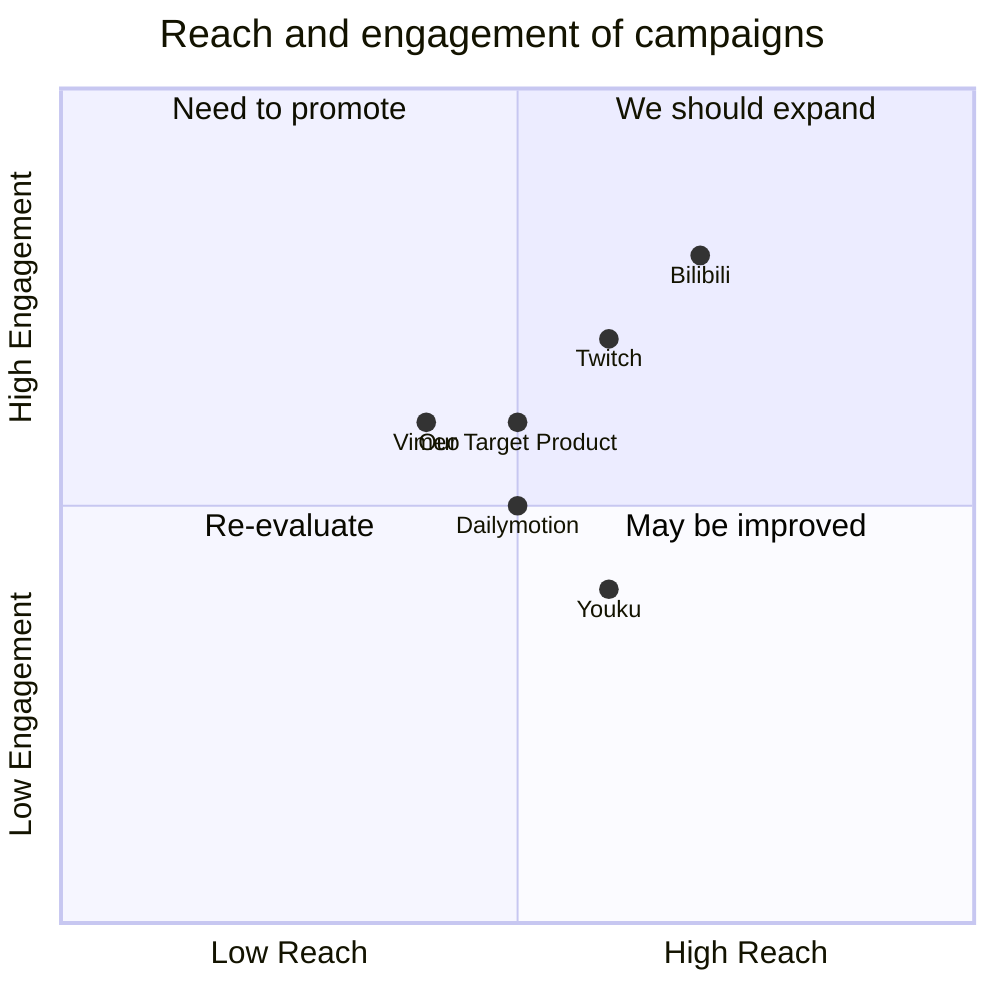

## Original Requirements
The boss wants a webpage that replicates the homepage of YouTube. The documentation for this project should be in Chinese.

## Product Goals
```python
[
    "Create a webpage that mirrors the functionality and design of YouTube's homepage",
    "Ensure the webpage is user-friendly and intuitive to navigate",
    "Provide comprehensive documentation in Chinese"
]
```

## User Stories
```python
[
    "As a user, I want to see a list of recommended videos when I open the webpage, so that I can easily find interesting content",
    "As a user, I want to be able to search for specific videos, so that I can find what I am looking for quickly",
    "As a user, I want to see a navigation bar with different categories, so that I can browse videos by category",
    "As a user, I want to see a sidebar with my subscriptions and playlists, so that I can easily access my personalized content",
    "As a user, I want to be able to switch to a dark mode, so that I can browse comfortably in low light conditions"
]
```

## Competitive Analysis
```python
[
    "Vimeo: A video-sharing platform similar to YouTube, but with a focus on high-quality content. Its homepage features a curated selection of videos, but lacks the personalized recommendations of YouTube.",
    "Dailymotion: Another video-sharing platform. Its homepage is similar to YouTube's, with a mix of recommended and trending videos. However, it doesn't have a sidebar for subscriptions and playlists.",
    "Twitch: Primarily a platform for live streaming, especially video games. Its homepage features live streams and recommended channels, but doesn't have the same variety of content as YouTube.",
    "Bilibili: A Chinese video-sharing platform. Its homepage is similar to YouTube's, with recommended videos, categories, and a sidebar. However, it also includes features like bullet comments, which may not be suitable for all users.",
    "Youku: Another Chinese video-sharing platform. Its homepage is more cluttered than YouTube's, with a mix of videos, ads, and other content."
]
```

## Competitive Quadrant Chart


## Requirement Analysis
The product should be a webpage that replicates the design and functionality of YouTube's homepage. It should include a list of recommended videos, a search bar, a navigation bar with different categories, and a sidebar with subscriptions and playlists. The webpage should also have a dark mode for comfortable browsing in low light conditions. All documentation should be provided in Chinese.

## Requirement Pool
```python
[
    ("Implement a list of recommended videos on the homepage", "P0"),
    ("Implement a search bar for finding specific videos", "P0"),
    ("Implement a navigation bar with different categories", "P0"),
    ("Implement a sidebar with subscriptions and playlists", "P0"),
    ("Implement a dark mode for the webpage", "P1"),
    ("Provide comprehensive documentation in Chinese", "P0")
]
```

## UI Design draft
The webpage should have a clean and intuitive design, similar to YouTube's homepage. At the top of the page, there should be a search bar and a navigation bar with different categories. Below this, there should be a list of recommended videos. On the left side of the page, there should be a sidebar with subscriptions and playlists. The webpage should also have a switch for turning on dark mode, which changes the color scheme to darker tones for comfortable browsing in low light conditions.

## Anything UNCLEAR
There are no unclear points.