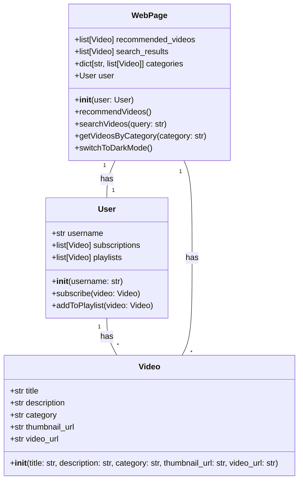
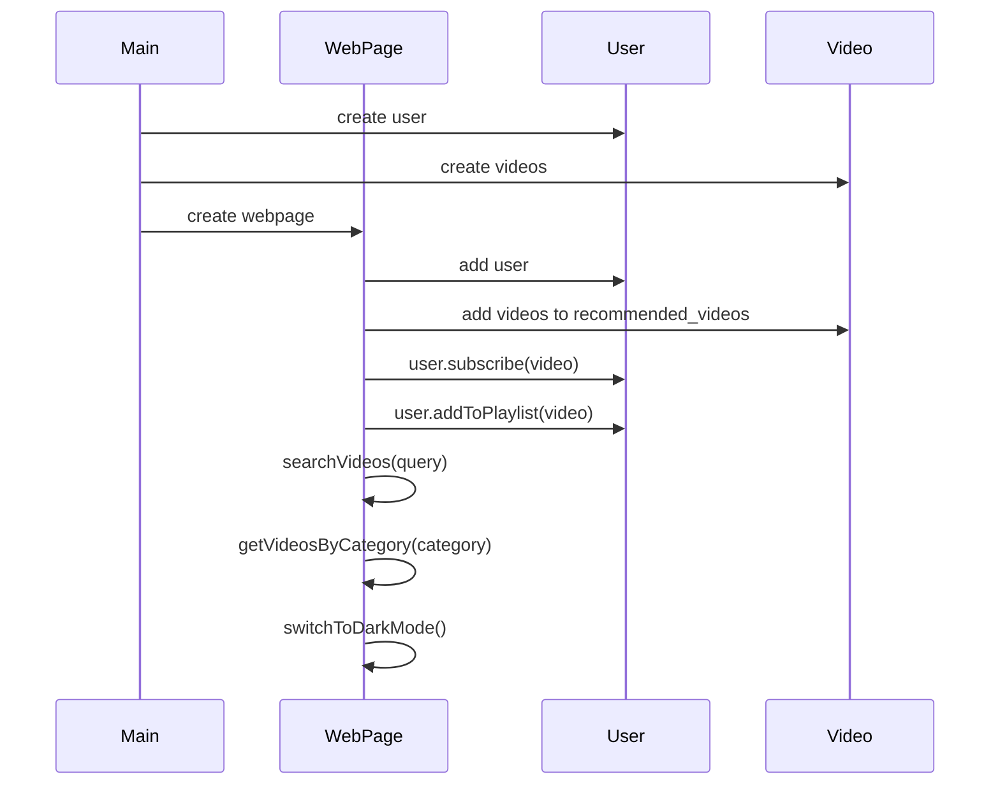

## Implementation approach
To implement this system, we will use Flask, a lightweight and flexible Python web framework. For the front-end, we will use Bootstrap to replicate the design of YouTube's homepage. The recommended videos, search functionality, categories, and sidebar will be implemented using Flask and Jinja2 templates. For the dark mode, we will use CSS and JavaScript to switch between different color schemes. The documentation will be written in Chinese using Sphinx, an open-source Python documentation generator.

## Python package name
```python
"youtube_clone"
```

## File list
```python
[
    "main.py",
    "templates/index.html",
    "static/css/styles.css",
    "static/js/dark_mode.js",
    "docs/index.rst"
]
```

## Data structures and interface definitions


## Program call flow


## Anything UNCLEAR
The requirement is clear to me.